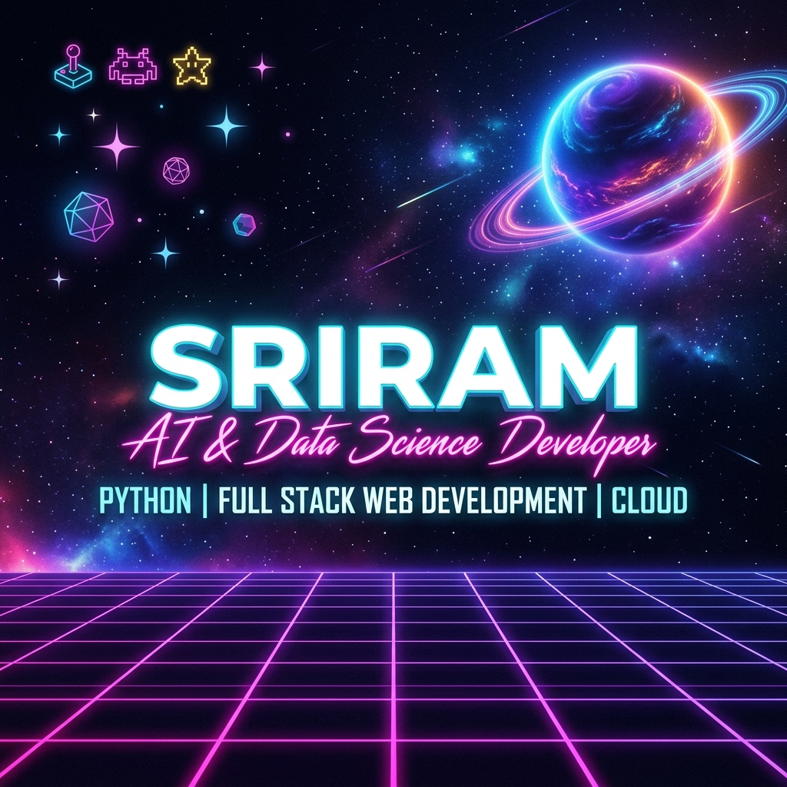

  

 

<h2 align="left">Connect with me. 👨‍💻</h2>

  
  &nbsp;
  
  &nbsp;
  

---

<h2 align="left">About Me. 🧑‍💻</h2>

- 🎓 **B.Tech Student** in Artificial Intelligence & Data Science at **Adithya Institute of Technology** *(Graduation: 2027)*
- 💡 **Interests:** Python Development, Full Stack Development, and Web Development
- 🛠️ **Practical Experience:** Python, Flask, HTML, CSS, JavaScript, MySQL, GitHub, and Google Cloud
- 🚀 **Focus:** Building responsive web applications and real-time interactive systems
- ⚡ **Key Skills:** Quick learner with strong problem-solving and teamwork capabilities
- 📧 **How to reach me:** [sr5698379@gmail.com](mailto:sr5698379@gmail.com)

---

<h2 align="left">Education 🎓</h2>

<table width="100%" border="0">
  <tr>
    <td width="50%" valign="top">
      <h3>🎓 Bachelor of Technology (B.Tech)</h3>
      
<b>Artificial Intelligence & Data Science</b> 
      <i>Adithya Institute of Technology</i> | 2023 – 2027 
      <b>CGPA:</b> 7.87

    </td>
    <td width="50%" valign="top">
      <h3>🏫 Higher Secondary Education (12th)</h3>
      
<b>Government Higher Secondary School</b> 
      <i>Thanikkottagam</i> | 2023 
      <b>Percentage:</b> 79%

    </td>
  </tr>
</table>

---

<h2 align="left">Technical Skills 🛠️</h2>

  <b>Programming Languages:</b> 
  
  
  

  <b>Web Technologies:</b> 
  
  
  

  <b>Database:</b> 
  

  <b>Tools & Platforms:</b> 
  
  
  

  <b>Core Concepts:</b> 
  
  
  
  

---

<h2 align="left">Featured Project 🚀</h2>

<table>
  <tr>
    <td>
      <h3>💬 SlimeChat – Real-Time Chat Web Application</h3>
      

        
        
        
        
        
        
        
      

      <ul>
        <li>Developed a full-stack real-time private chat application using Flask and Flask-SocketIO.</li>
        <li>Implemented user authentication and MySQL database integration.</li>
        <li>Enabled real-time one-to-one messaging using WebSocket communication.</li>
        <li>Designed a modern glassmorphism interface with animated GIF elements.</li>
      </ul>
      

        
      

    </td>
  </tr>
</table>

---

<h2 align="left">Internship Experience 💼</h2>

<table>
  <tr>
    <td>
      <h3>Full Stack Web Development Intern</h3>
      
<b>Marcello Tech</b> | <i>Jan 2024 – Apr 2024</i>

      <ul>
        <li>Developed responsive web pages using HTML, CSS, and JavaScript.</li>
        <li>Assisted in backend development using Python and MySQL.</li>
        <li>Collaborated with the development team to build and test web applications.</li>
        <li>Debugged applications and improved website performance.</li>
      </ul>
    </td>
  </tr>
</table>

---

<h2 align="left">Certifications & Soft Skills 🏆</h2>

<table width="100%" border="0">
  <tr>
    <td width="50%" valign="top">
      <h3>📜 Certifications</h3>
      <ul>
        <li>☁️ <b>Google Cloud Skill Badges</b></li>
        <li>🐍 <b>Python Programming Certificate</b></li>
        <li>🌐 <b>Learn HTML – Programiz</b></li>
      </ul>
    </td>
    <td width="50%" valign="top">
      <h3>💡 Soft Skills</h3>
      

        
         
        
        
      

    </td>
  </tr>
</table>

---

<h2 align="left">Stats 📊</h2>

  
  &nbsp;&nbsp;

 

